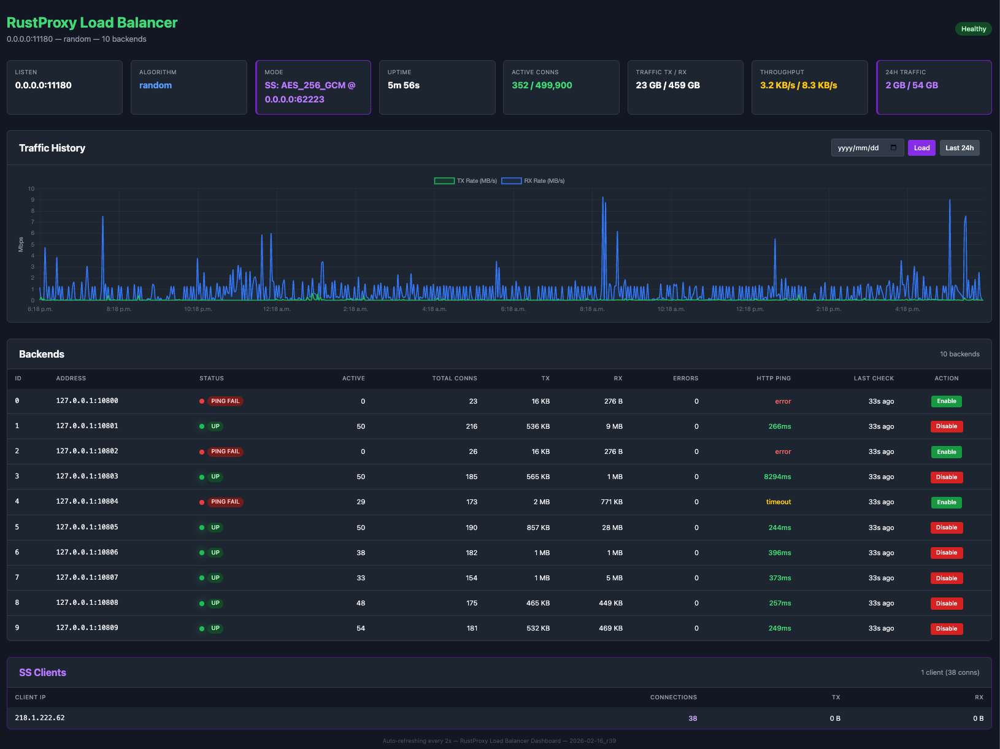

# RustProxy

A high-performance proxy server written in Rust with configurable connection caching and real-time web dashboard.



## Motivation

This project was inspired by the limitations of HAProxy + SOCKS load balancing setups, which proved to be unstable in production environments. Existing solutions lacked robust performance caching and strong backend disable mechanisms. RustProxy was vibe-coded to address these pain points with a focus on stability, performance, and operational visibility.

## Features

- **TCP Proxy**: Forward TCP connections to target servers
- **TCP Load Balancing**: Distribute connections across multiple backends with round-robin or random algorithms
- **Shadowsocks Server**: Accept encrypted SS client connections with AEAD ciphers (standalone or combined with TCP LB)
- **HTTP Proxy**: Forward HTTP requests to target servers
- **SOCKS5 Proxy**: Full SOCKS5 server with optional authentication
- **Connection Caching**: Configurable connection pooling to improve performance
- **Web Dashboard**: Built-in HAProxy-style dashboard for load balancer monitoring and control
- **Healthcheck**: Automatic backend health probing with disable/re-enable logic
- **REST API**: Enable/disable backends at runtime via HTTP API
- **Async/Await**: Built with Tokio for high-performance async networking
- **Flexible Configuration**: Command-line configuration with sensible defaults

## Installation

Make sure you have Rust installed, then build the project:

```bash
cargo build --release
```

## Usage

```bash
rustproxy --listen <address:port> [--target <address:port>] --mode <tcp|http|socks5|ss> [options]
```

### Options

- `--listen <address:port>` - Address to listen on
- `--target <address:port>` - Address to proxy requests to (required for tcp mode). Comma-separated for load balancing
- `--mode <tcp|http|socks5|ss>` - Proxy mode
- `--cache-size <size>` - Connection cache size (default: 64MB)
  - Examples: `0`, `none`, `256kb`, `1mb`, `8mb`
- `--buffer-size <size>` - Server-to-client relay buffer (default: 16MB)
- `--socks5-auth <user:pass>` - SOCKS5 authentication credentials (optional)
- `--ss-password <password>` - Shadowsocks pre-shared key (required for `ss` mode, optional for `tcp` mode)
- `--ss-method <cipher>` - Shadowsocks cipher (default: `aes-256-gcm`). Supported: `aes-128-gcm`, `aes-256-gcm`, `chacha20-ietf-poly1305`
- `--ss-listen-port <addr:port>` - Separate SS listener port (tcp mode). Plain TCP on `--listen`, SS on this port
- `--lb <random|roundrobin>` - Load balancing algorithm (tcp mode, requires multiple targets)
- `--http-interface <addr:port>` - HTTP dashboard for LB monitoring (e.g. `:8888`)
- `--healthcheck` - Enable HTTP ping healthcheck for TCP LB backends (60s interval)
- `--traffic-log <path>` - CSV file for persistent traffic history (default: `./rustproxy_traffic.csv`)
- `--manager-addr <addr:port>` - Manager address for stats reporting

### Examples

**TCP Proxy with default caching (256KB):**
```bash
rustproxy --listen 127.0.0.1:8080 --target 192.168.1.100:9000 --mode tcp
```

**TCP Proxy with 1MB connection cache:**
```bash
rustproxy --listen 127.0.0.1:8080 --target 192.168.1.100:9000 --mode tcp --cache-size 1mb
```

**TCP Proxy with caching disabled:**
```bash
rustproxy --listen 127.0.0.1:8080 --target 192.168.1.100:9000 --mode tcp --cache-size 0
```

**TCP Load Balancer (round-robin across 3 backends):**
```bash
rustproxy --listen 127.0.0.1:8080 \
  --target 192.168.1.100:9000,192.168.1.100:9001,192.168.1.100:9002 \
  --mode tcp --lb roundrobin --http-interface :8888
```

**TCP Load Balancer (random algorithm, 1MB cache):**
```bash
rustproxy --listen 127.0.0.1:8080 \
  --target 10.0.0.1:3000,10.0.0.2:3000,10.0.0.3:3000 \
  --mode tcp --lb random --cache-size 1mb --http-interface :8888
```

**TCP Load Balancer with SOCKS5 healthcheck:**
```bash
rustproxy --listen 127.0.0.1:8080 \
  --target 10.0.0.1:1080,10.0.0.2:1080,10.0.0.3:1080 \
  --mode tcp --lb roundrobin --http-interface :8888 --healthcheck
```

**HTTP Proxy (local server, no forwarding):**
```bash
rustproxy --listen 127.0.0.1:8080 --mode http
```

**SOCKS5 Proxy (no authentication):**
```bash
rustproxy --listen 127.0.0.1:1080 --mode socks5
```

**SOCKS5 Proxy with authentication:**
```bash
rustproxy --listen 127.0.0.1:1080 --mode socks5 --socks5-auth username:password
```

**SOCKS5 Proxy with custom cache size:**
```bash
rustproxy --listen 127.0.0.1:1080 --mode socks5 --cache-size 2mb
```

**Shadowsocks Server (standalone):**
```bash
rustproxy --listen 0.0.0.0:8388 --mode ss --ss-password mypassword --ss-method aes-256-gcm
```

**Shadowsocks + TCP Load Balancer (SS decryption with LB to backends):**
```bash
rustproxy --listen 0.0.0.0:11180 \
  --target 127.0.0.1:10800,127.0.0.1:10801,127.0.0.1:10802,127.0.0.1:10803,127.0.0.1:10804,127.0.0.1:10805,127.0.0.1:10809,127.0.0.1:10808 \
  --mode tcp --ss-password mypassword --ss-method aes-256-gcm \
  --http-interface 0.0.0.0:62088 --healthcheck
```

**Shadowsocks + TCP Load Balancer (separate ports for plain TCP and SS):**
```bash
rustproxy --listen 0.0.0.0:11180 \
  --target 127.0.0.1:10800,127.0.0.1:10801,127.0.0.1:10802 \
  --mode tcp --ss-password mypassword --ss-method aes-256-gcm \
  --ss-listen-port 11181 --http-interface 0.0.0.0:62088 --healthcheck
```
This gives port 11180 for plain TCP load balancing and port 11181 for SS clients, both routing to the same backends.

In SS+TCP LB mode, rustproxy accepts encrypted Shadowsocks client connections, decrypts the traffic, then load-balances across the backend targets. Connect with any standard SS client:
```bash
# Start a local SOCKS5 proxy that tunnels through the SS server
sslocal -b 127.0.0.1:1080 -s <server-ip>:11180 -k mypassword -m aes-256-gcm

# Then use the local SOCKS5 proxy
curl -x socks5h://127.0.0.1:1080 http://example.com
```

## Architecture

- **TCP Proxy** (`src/tcp_proxy.rs`): Handles raw TCP connection forwarding, supports single-target, load-balanced, and SS-encrypted modes
- **Shadowsocks Proxy** (`src/ss_proxy.rs`): Standalone Shadowsocks server using the `shadowsocks` crate for AEAD decryption
- **Load Balancer** (`src/lb.rs`): Round-robin and random algorithms, per-backend atomic stats, runtime enable/disable
- **Healthcheck** (`src/healthcheck.rs`): HTTP ping backend health probing with automatic disable/re-enable
- **Web Dashboard** (`src/web.rs`): Axum-based HTTP server serving the LB dashboard and REST API
- **Dashboard UI** (`static/lb_dashboard.html`): HAProxy-style web interface with auto-refresh
- **HTTP Proxy** (`src/http_proxy.rs`): Handles HTTP request/response forwarding
- **SOCKS5 Proxy** (`src/socks5_proxy.rs`): Full SOCKS5 server implementation with authentication support
- **Connection Cache** (`src/connection_cache.rs`): Manages connection pooling for performance optimization
- **Stats** (`src/stats.rs`): Per-connection and aggregate statistics with UDP reporting
- **Manager** (`src/manager.rs`): Central manager dashboard for monitoring all proxy instances
- **Main** (`src/main.rs`): Command-line interface and application startup

## Load Balancing

When multiple targets are specified (comma-separated), rustproxy operates in load balancing mode, distributing incoming TCP connections across the backends.

### Algorithms

| Algorithm | Flag | Description |
|-----------|------|-------------|
| Round Robin | `--lb roundrobin` | Cycles through enabled backends sequentially |
| Random | `--lb random` | Selects a random enabled backend for each connection |

If `--lb` is not specified but multiple targets are given, round-robin is used by default.

### Web Dashboard

When `--http-interface` is specified, a built-in web dashboard is available with:

- **Summary header**: Listen address, algorithm, uptime, total active connections, aggregate TX/RX, throughput rates
- **Traffic history graph**: Real-time visualization of TX/RX rates with historical data
- **Backend table**: ID, address, status (UP/PING FAIL/DISABLED), active connections, total connections, TX, RX, errors, HTTP ping latency
- **Enable/Disable buttons**: Toggle backends on/off at runtime (admin-controlled disable persists through health checks)
- **SS Clients section**: View active Shadowsocks client connections with IP addresses and traffic stats
- **SS mode badge**: Shows cipher method when running in SS+TCP LB mode
- **Auto-refresh**: Polls `/api/stats` and `/api/connections` every 2 seconds
- **Color coding**: Green = enabled, Red = disabled/failed, Yellow = has errors
- **24-hour traffic tracking**: Persistent traffic statistics across restarts

### REST API

| Endpoint | Method | Description |
|----------|--------|-------------|
| `/` | GET | Web dashboard |
| `/api/backends` | GET | JSON list of all backends with algorithm |
| `/api/backends/:id/enable` | POST | Enable a backend |
| `/api/backends/:id/disable` | POST | Disable a backend |
| `/api/stats` | GET | Full stats (uptime, connections, bytes, all backends) |
| `/api/connections` | GET | Active and recent per-connection stats |
| `/api/health` | GET | Health check |

**Example API usage:**
```bash
# List backends
curl http://localhost:8888/api/backends

# Disable backend 1
curl -X POST http://localhost:8888/api/backends/1/disable

# Re-enable backend 1
curl -X POST http://localhost:8888/api/backends/1/enable

# Get full stats
curl http://localhost:8888/api/stats
```

### Healthcheck

When `--healthcheck` is enabled (TCP LB mode only), rustproxy continuously monitors backend health:

- **Probe method**: Direct HTTP GET to each backend, verifies `HTTP/` response
- **Interval**: Every 60 seconds (5-second initial delay after startup)
- **Timeout**: 10 seconds per probe
- **On success**: Backend stays enabled (or is re-enabled if previously disabled); response time is recorded
- **On failure/timeout**: Backend is disabled and removed from rotation
- **Admin override**: Backends manually disabled via API/dashboard stay disabled even if health checks pass
- **Safety valve**: If ALL backends fail, all are re-enabled to avoid total outage
- **Dashboard integration**: Healthcheck status and response times are visible in the web dashboard

### Self-Test

On startup in LB mode, rustproxy performs a non-blocking self-test:
1. Tries connecting to the proxy listener (5s timeout)
2. Tries connecting to each backend (3s timeout)
3. Logs PASS/WARN for each — warnings only, does not block startup

## SOCKS5 Features

- **Protocol Compliance**: Full SOCKS5 protocol implementation (RFC 1928)
- **Authentication Methods**:
  - No authentication (anonymous access)
  - Username/password authentication (RFC 1929)
- **Connection Types**: CONNECT command support (most common use case)
- **Address Types**: IPv4, IPv6, and domain name resolution
- **Connection Caching**: Reuse connections for improved performance
- **Error Handling**: Proper SOCKS5 error responses for various failure conditions

### SOCKS5 Client Configuration

To use the SOCKS5 proxy with various applications:

**cURL:**
```bash
curl --socks5 127.0.0.1:1080 https://example.com
curl --socks5-hostname 127.0.0.1:1080 https://example.com  # DNS through proxy
```

**SSH:**
```bash
ssh -o ProxyCommand='nc -X 5 -x 127.0.0.1:1080 %h %p' user@target.com
```

**Firefox:**
- Go to Settings → Network Settings → Manual proxy configuration
- Set SOCKS Host: 127.0.0.1, Port: 1080, SOCKS v5

**Environment Variables:**
```bash
export ALL_PROXY=socks5://127.0.0.1:1080
export all_proxy=socks5://127.0.0.1:1080
```

## Development

### Running Tests

**Quick validation:**
```bash
./test_simple.sh
```

**Unit tests only:**
```bash
cargo test
```

**Comprehensive integration tests:**
```bash
./test_all.sh
```

### Running Benchmarks

```bash
cargo bench
```

### Dependencies

- **tokio**: Async runtime
- **axum**: Web framework (dashboard + REST API)
- **hyper**: HTTP client/server library
- **shadowsocks**: Shadowsocks protocol (AEAD cipher decryption, proxy listener)
- **rand**: Random backend selection
- **tracing**: Structured logging
- **serde/serde_json**: JSON serialization
- **bytes**: Byte buffer utilities
- **futures-util**: Future utilities

## License

Licensed under either of:

- Apache License, Version 2.0 ([LICENSE-APACHE](LICENSE-APACHE) or http://www.apache.org/licenses/LICENSE-2.0)
- MIT license ([LICENSE-MIT](LICENSE-MIT) or http://opensource.org/licenses/MIT)

at your option.

### Contribution

Unless you explicitly state otherwise, any contribution intentionally submitted for inclusion in the work by you, as defined in the Apache-2.0 license, shall be dual licensed as above, without any additional terms or conditions.
