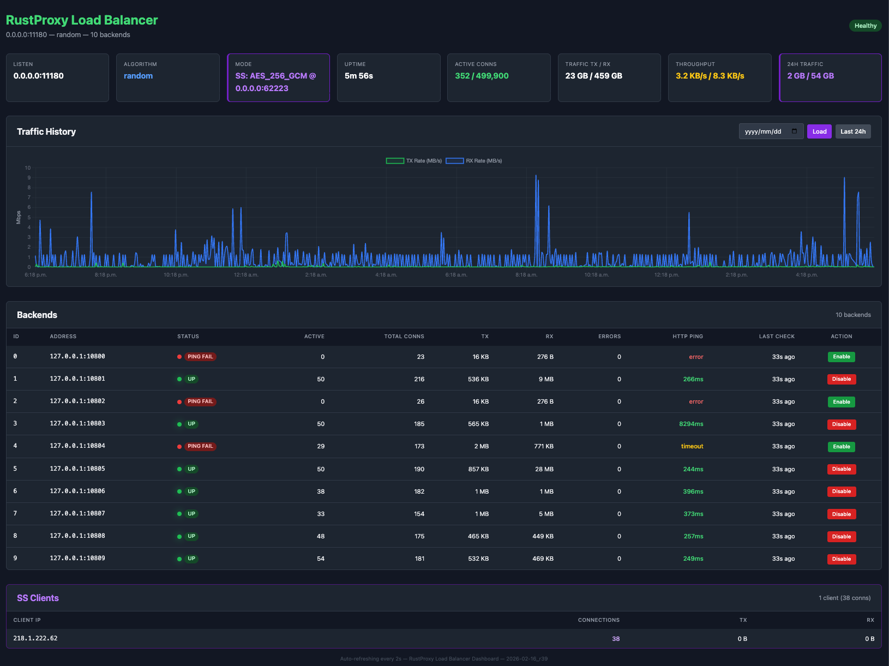

# RustProxy

A high-performance proxy server written in Rust with load balancing, Shadowsocks/VMess listeners, and a real-time web dashboard.



## Motivation

This project was inspired by the limitations of HAProxy + SOCKS load balancing setups, which proved to be unstable in production environments. Existing solutions lacked strong backend disable mechanisms and operational visibility. RustProxy focuses on stability, throughput, and day-2 ops (dashboard, healthchecks, self-update, self-bench).

## Features

- **TCP Proxy**: High-speed byte-forwarding to a target (or LB backends)
- **TCP Load Balancing**: Round-robin or random across multiple backends; admin drain/kill
- **Shadowsocks Server**: AEAD ciphers (standalone or combined with TCP LB)
- **VMess listener**: AEAD mode on a separate port (TCP LB path)
- **HTTP Proxy**: Forward proxy + HTTPS `CONNECT` tunnels
- **SOCKS5 Proxy**: CONNECT + UDP ASSOCIATE, optional user/pass auth
- **Web Dashboard**: LB stats, enable/disable backends, traffic history
- **Healthcheck**: TCP or SOCKS5 probes; disable after consecutive failures (drain, no kill)
- **Self-update**: `rustproxy --update` from GitHub releases
- **Self-bench**: `rustproxy --bench` localhost loopback throughput (direct/tcp/socks5/http)
- **DNS**: Custom UDP/TCP/DoT/DoH resolvers with multi-IP connect fallback

## Installation

### One-line install (recommended)

Downloads the latest release binary into the current directory. Auto-detects
Linux/macOS and x86_64/arm64.

```bash
curl -fsSL https://raw.githubusercontent.com/c2h2/rustproxy/master/scripts/install.sh | bash
```

Install elsewhere or pin a version:

```bash
curl -fsSL https://raw.githubusercontent.com/c2h2/rustproxy/master/scripts/install.sh | INSTALL_DIR=/usr/local/bin bash
curl -fsSL https://raw.githubusercontent.com/c2h2/rustproxy/master/scripts/install.sh | VERSION=v1.0.0 bash
```

Supported targets: `linux-amd64`, `linux-arm64` (musl, static), `macos-arm64`.

### Self-update

Re-download the latest GitHub release for this platform and replace the
running binary in place (always downloads — never skips):

```bash
rustproxy --update
rustproxy --version
```

### Self-bench (localhost loopback)

Built-in throughput test. Spins up an in-process sink/source server and
measures **upload + download** through each mode on `127.0.0.1`:

| mode | what is measured |
|------|------------------|
| `direct` | client → backend (no proxy baseline) |
| `tcp` | client → TCP forward proxy → backend |
| `socks5` | client → SOCKS5 CONNECT → backend |
| `http` | client → HTTP `CONNECT` tunnel → backend |
| `ss` | client → Shadowsocks (AES-256-GCM) → backend |

```bash
rustproxy --bench
rustproxy --bench --size 512
rustproxy --bench --modes tcp,socks5,ss --size 128 --warmup 1
```

MB/s is decimal megabytes/sec. Loopback is noisy and is an **upper bound**,
not a WAN estimate. On a quiet Apple Silicon host, single-stream TCP forward
is often multi‑GB/s (see your local `--bench` table).

### Build from source

Make sure you have Rust installed, then build the project:

```bash
cargo build --release
```

## Usage

```bash
rustproxy --listen <address:port> [--target <address:port>] --mode <tcp|http|socks5|ss> [options]
rustproxy --bench [--size MiB] [--modes direct,tcp,socks5,http,ss]
rustproxy --update
```

### Options

- `--listen <address:port>` - Address to listen on
- `--target <address:port>` - Address to proxy requests to (required for tcp mode). Comma-separated for load balancing
- `--mode <tcp|http|socks5|ss>` - Proxy mode
- `--cache-size <size>` - Legacy CLI size (outbound stream pooling is **disabled** by design; kept for compatibility). Examples: `0`, `256kb`, `1mb`
- `--buffer-size <size>` - Per-direction pump read buffer (default **256kb**, clamped 8kb–4mb)
- `--tcp-keepalive-time <secs>` - Keepalive idle before first probe (default **120**)
- `--tcp-keepalive-interval <secs>` - Keepalive probe interval (default **30**)
- `--tcp-keepalive-retries <n>` - Unanswered probes before drop (default **3**)
- `--tcp-user-timeout <secs>` - Linux `TCP_USER_TIMEOUT`; **0** disables (default **0**)
- `--tcp-sndbuf` / `--tcp-rcvbuf` - `SO_SNDBUF` / `SO_RCVBUF` (default **4mb**)
- `--socks5-auth <user:pass>` - SOCKS5 authentication credentials (optional)
- `--ss-password <password>` - Shadowsocks pre-shared key (required for `ss` mode, optional for `tcp` mode)
- `--ss-method <cipher>` - Shadowsocks cipher (default: `aes-256-gcm`). Supported: `aes-128-gcm`, `aes-256-gcm`, `chacha20-ietf-poly1305`
- `--ss-listen-port <addr:port>` - Separate SS listener port (tcp mode). Plain TCP on `--listen`, SS on this port
- `--lb <random|roundrobin>` - Load balancing algorithm (tcp mode, requires multiple targets)
- `--http-interface <addr:port>` - HTTP dashboard for LB monitoring (e.g. `:8888`)
- `--healthcheck` - Enable healthcheck for TCP LB backends (60s interval; drain on failure)
- `--healthcheck-probe <tcp|socks5>` - Probe kind (default: tcp, or socks5 when SS/VMess listeners set)
- `--traffic-log <path>` - CSV file for persistent traffic history (default: `./rustproxy_traffic.csv`)
- `--manager-addr <addr:port>` - Manager address for stats reporting
- `--dns <servers>` - Custom DNS resolvers (overrides system DNS for all outbound lookups). Comma-separated list of one or more upstreams. Each entry may be:
  - `8.8.8.8` — UDP on port 53
  - `8.8.8.8:53` — UDP on explicit port
  - `udp://1.1.1.1` — UDP (explicit prefix)
  - `tcp://1.1.1.1` — DNS over TCP (port 53 default)
  - `tls://1.1.1.1` — DNS-over-TLS (DoT, port 853 default; bare IPs work with public resolvers like `1.1.1.1`/`8.8.8.8`/`9.9.9.9` whose certs carry IP SANs; hostnames like `tls://dns.google` also accepted)
  - `https://cloudflare-dns.com/dns-query` — DNS-over-HTTPS (DoH; hostname required so the TLS cert validates — bare-IP DoH URLs are rejected)

  Queries retry up to 3 times with a 3s per-try timeout; connect tries **all** resolved IPs until one accepts.
- `--dns-cache-size <N>` - Max cached DNS entries when `--dns` is set (default: `16384`, hard cap: `262144`). Entries respect DNS TTL; only useful working-set size is bounded.
- `--update` - Re-download latest GitHub release binary into place
- `--bench` - Localhost loopback throughput suite (see above)
- `--version` / `-V` - Print version and exit

Admin disable API: `POST /api/backends/:id/disable` drains in-flight connections;
append `?kill=1` to abort them immediately.

### Examples

**TCP Proxy:**
```bash
rustproxy --listen 127.0.0.1:8080 --target 192.168.1.100:9000 --mode tcp
```

**TCP Proxy with larger pump buffer:**
```bash
rustproxy --listen 127.0.0.1:8080 --target 192.168.1.100:9000 --mode tcp --buffer-size 1mb
```

**TCP Load Balancer (round-robin across 3 backends):**
```bash
rustproxy --listen 127.0.0.1:8080 \
  --target 192.168.1.100:9000,192.168.1.100:9001,192.168.1.100:9002 \
  --mode tcp --lb roundrobin --http-interface :8888
```

**TCP Load Balancer (random algorithm, 1MB cache):**
```bash
rustproxy --listen 127.0.0.1:8080 \
  --target 10.0.0.1:3000,10.0.0.2:3000,10.0.0.3:3000 \
  --mode tcp --lb random --cache-size 1mb --http-interface :8888
```

**TCP Load Balancer with SOCKS5 healthcheck:**
```bash
rustproxy --listen 127.0.0.1:8080 \
  --target 10.0.0.1:1080,10.0.0.2:1080,10.0.0.3:1080 \
  --mode tcp --lb roundrobin --http-interface :8888 --healthcheck
```

**HTTP Proxy (local server, no forwarding):**
```bash
rustproxy --listen 127.0.0.1:8080 --mode http
```

**SOCKS5 Proxy (no authentication):**
```bash
rustproxy --listen 127.0.0.1:1080 --mode socks5
```

**SOCKS5 Proxy with authentication:**
```bash
rustproxy --listen 127.0.0.1:1080 --mode socks5 --socks5-auth username:password
```

**SOCKS5 Proxy with custom cache size:**
```bash
rustproxy --listen 127.0.0.1:1080 --mode socks5 --cache-size 2mb
```

**Shadowsocks Server (standalone):**
```bash
rustproxy --listen 0.0.0.0:8388 --mode ss --ss-password mypassword --ss-method aes-256-gcm
```

**Shadowsocks + TCP Load Balancer (SS decryption with LB to backends):**
```bash
rustproxy --listen 0.0.0.0:11180 \
  --target 127.0.0.1:10800,127.0.0.1:10801,127.0.0.1:10802,127.0.0.1:10803,127.0.0.1:10804,127.0.0.1:10805,127.0.0.1:10809,127.0.0.1:10808 \
  --mode tcp --ss-password mypassword --ss-method aes-256-gcm \
  --http-interface 0.0.0.0:62088 --healthcheck
```

**Shadowsocks + TCP Load Balancer (separate ports for plain TCP and SS):**
```bash
rustproxy --listen 0.0.0.0:11180 \
  --target 127.0.0.1:10800,127.0.0.1:10801,127.0.0.1:10802 \
  --mode tcp --ss-password mypassword --ss-method aes-256-gcm \
  --ss-listen-port 11181 --http-interface 0.0.0.0:62088 --healthcheck
```
This gives port 11180 for plain TCP load balancing and port 11181 for SS clients, both routing to the same backends.

In SS+TCP LB mode, rustproxy accepts encrypted Shadowsocks client connections, decrypts the traffic, then load-balances across the backend targets. Connect with any standard SS client:
```bash
# Start a local SOCKS5 proxy that tunnels through the SS server
sslocal -b 127.0.0.1:1080 -s <server-ip>:11180 -k mypassword -m aes-256-gcm

# Then use the local SOCKS5 proxy
curl -x socks5h://127.0.0.1:1080 http://example.com
```

### Custom DNS Examples

Useful when the system resolver is failing (`failed to lookup address information`), when you want to bypass a captive resolver, or when you need DoH for privacy.

**HTTP proxy with Google + Cloudflare UDP DNS (failover):**
```bash
rustproxy --listen 127.0.0.1:8080 --mode http --dns 8.8.8.8,1.1.1.1
```

**SOCKS5 proxy with DNS-over-HTTPS:**
```bash
rustproxy --listen 127.0.0.1:1080 --mode socks5 \
  --dns https://cloudflare-dns.com/dns-query,https://dns.google/dns-query
```

**TCP LB with mixed UDP + DoH upstreams:**
```bash
rustproxy --listen 127.0.0.1:8080 \
  --target backend1.example.com:443,backend2.example.com:443 \
  --mode tcp --lb roundrobin \
  --dns 1.1.1.1,https://dns.google/dns-query
```

**HTTP proxy using a non-standard UDP DNS port:**
```bash
rustproxy --listen 127.0.0.1:8080 --mode http --dns 9.9.9.9:53,udp://149.112.112.112
```

**HTTP proxy with DNS-over-TLS (encrypted DNS, redundant upstreams):**
```bash
rustproxy --listen 127.0.0.1:8080 --mode http --dns tls://1.1.1.1,tls://8.8.8.8
```

**DNS over TCP (e.g. when UDP/53 is blocked):**
```bash
rustproxy --listen 127.0.0.1:8080 --mode http --dns tcp://1.1.1.1,tcp://8.8.8.8
```

When `--dns` is set, the system resolver is **not** used — every hostname (TCP, SOCKS5, HTTP, Shadowsocks) is resolved through the configured upstreams in order.

## Architecture

- **TCP Proxy** (`src/tcp_proxy.rs`): Handles raw TCP connection forwarding, supports single-target, load-balanced, and SS-encrypted modes
- **Shadowsocks Proxy** (`src/ss_proxy.rs`): Standalone Shadowsocks server using the `shadowsocks` crate for AEAD decryption
- **Load Balancer** (`src/lb.rs`): Round-robin and random algorithms, per-backend atomic stats, runtime enable/disable
- **Healthcheck** (`src/healthcheck.rs`): HTTP ping backend health probing with automatic disable/re-enable
- **Web Dashboard** (`src/web.rs`): Axum-based HTTP server serving the LB dashboard and REST API
- **Dashboard UI** (`static/lb_dashboard.html`): HAProxy-style web interface with auto-refresh
- **HTTP Proxy** (`src/http_proxy.rs`): Handles HTTP request/response forwarding
- **SOCKS5 Proxy** (`src/socks5_proxy.rs`): Full SOCKS5 server implementation with authentication support
- **Connection Cache** (`src/connection_cache.rs`): Manages connection pooling for performance optimization
- **Stats** (`src/stats.rs`): Per-connection and aggregate statistics with UDP reporting
- **Manager** (`src/manager.rs`): Central manager dashboard for monitoring all proxy instances
- **Main** (`src/main.rs`): Command-line interface and application startup

## Load Balancing

When multiple targets are specified (comma-separated), rustproxy operates in load balancing mode, distributing incoming TCP connections across the backends.

### Algorithms

| Algorithm | Flag | Description |
|-----------|------|-------------|
| Round Robin | `--lb roundrobin` | Cycles through enabled backends sequentially |
| Random | `--lb random` | Selects a random enabled backend for each connection |

If `--lb` is not specified but multiple targets are given, round-robin is used by default.

### Web Dashboard

When `--http-interface` is specified, a built-in web dashboard is available with:

- **Summary header**: Listen address, algorithm, uptime, total active connections, aggregate TX/RX, throughput rates
- **Traffic history graph**: Real-time visualization of TX/RX rates with historical data
- **Backend table**: ID, address, status (UP/PING FAIL/DISABLED), active connections, total connections, TX, RX, errors, HTTP ping latency
- **Enable/Disable buttons**: Toggle backends on/off at runtime (admin-controlled disable persists through health checks)
- **SS Clients section**: View active Shadowsocks client connections with IP addresses and traffic stats
- **SS mode badge**: Shows cipher method when running in SS+TCP LB mode
- **Auto-refresh**: Polls `/api/stats` and `/api/connections` every 2 seconds
- **Color coding**: Green = enabled, Red = disabled/failed, Yellow = has errors
- **24-hour traffic tracking**: Persistent traffic statistics across restarts

### REST API

| Endpoint | Method | Description |
|----------|--------|-------------|
| `/` | GET | Web dashboard |
| `/api/backends` | GET | JSON list of all backends with algorithm |
| `/api/backends/:id/enable` | POST | Enable a backend |
| `/api/backends/:id/disable` | POST | Disable a backend |
| `/api/stats` | GET | Full stats (uptime, connections, bytes, all backends) |
| `/api/connections` | GET | Active and recent per-connection stats |
| `/api/health` | GET | Health check |

**Example API usage:**
```bash
# List backends
curl http://localhost:8888/api/backends

# Disable backend 1
curl -X POST http://localhost:8888/api/backends/1/disable

# Re-enable backend 1
curl -X POST http://localhost:8888/api/backends/1/enable

# Get full stats
curl http://localhost:8888/api/stats
```

### Healthcheck

When `--healthcheck` is enabled (TCP LB mode only), rustproxy continuously monitors backend health:

- **Probe method**: Direct HTTP GET to each backend, verifies `HTTP/` response
- **Interval**: Every 60 seconds (5-second initial delay after startup)
- **Timeout**: 10 seconds per probe
- **On success**: Backend stays enabled (or is re-enabled if previously disabled); response time is recorded
- **On failure/timeout**: Backend is disabled and removed from rotation
- **Admin override**: Backends manually disabled via API/dashboard stay disabled even if health checks pass
- **Safety valve**: If ALL backends fail, all are re-enabled to avoid total outage
- **Dashboard integration**: Healthcheck status and response times are visible in the web dashboard

### Self-Test

On startup in LB mode, rustproxy performs a non-blocking self-test:
1. Tries connecting to the proxy listener (5s timeout)
2. Tries connecting to each backend (3s timeout)
3. Logs PASS/WARN for each — warnings only, does not block startup

## SOCKS5 Features

- **Protocol Compliance**: Full SOCKS5 protocol implementation (RFC 1928)
- **Authentication Methods**:
  - No authentication (anonymous access)
  - Username/password authentication (RFC 1929)
- **Connection Types**: CONNECT command support (most common use case)
- **Address Types**: IPv4, IPv6, and domain name resolution
- **Connection Caching**: Reuse connections for improved performance
- **Error Handling**: Proper SOCKS5 error responses for various failure conditions

### SOCKS5 Client Configuration

To use the SOCKS5 proxy with various applications:

**cURL:**
```bash
curl --socks5 127.0.0.1:1080 https://example.com
curl --socks5-hostname 127.0.0.1:1080 https://example.com  # DNS through proxy
```

**SSH:**
```bash
ssh -o ProxyCommand='nc -X 5 -x 127.0.0.1:1080 %h %p' user@target.com
```

**Firefox:**
- Go to Settings → Network Settings → Manual proxy configuration
- Set SOCKS Host: 127.0.0.1, Port: 1080, SOCKS v5

**Environment Variables:**
```bash
export ALL_PROXY=socks5://127.0.0.1:1080
export all_proxy=socks5://127.0.0.1:1080
```

## Development

### Running Tests

**Quick validation:**
```bash
./test_simple.sh
```

**Unit tests only:**
```bash
cargo test
```

**Comprehensive integration tests:**
```bash
./test_all.sh
```

### Running Benchmarks

```bash
cargo bench
```

### Local Benchmark Results

Measured on Apple M4 (macOS), loopback, release build (2026-07):

| Scenario | Tool | Result |
|---|---|---|
| TCP relay throughput (`--mode tcp`) | `iperf3 -t 5` | **86.3 Gbit/s** (direct loopback baseline: 140 Gbit/s) |
| HTTP forward proxy, plain HTTP (`--mode http`) | `hey -n 50000 -c 100` | **56,000 req/s**, avg 1.7 ms, p99 4.6 ms |
| HTTPS via CONNECT tunnel | `hey -n 50000 -c 100` | **~1,700 req/s** (bounded by the single-threaded Node.js TLS test backend), 100% 2xx |
| CONNECT tunnel bulk download (200 MB) | `curl` | **438 MB/s** (~3.5 Gbit/s, bounded by the Node.js TLS test backend) |

Reproduce: run a local backend (`node -e 'require("http").createServer((q,s)=>s.end("ok")).listen(9000)'`), start `rustproxy --listen 127.0.0.1:18080 --mode http`, then `hey -n 50000 -c 100 -x http://127.0.0.1:18080 http://127.0.0.1:9000/`. For TCP mode, point `--target` at a local `iperf3 -s` and run `iperf3 -c` against the proxy port.

### vs Squid 6.13

Same machine, same backend and load; Squid configured with caching and access logging disabled:

| Metric | rustproxy | Squid 6.13 |
|---|---|---|
| Plain HTTP forward proxy (`hey -c 100`) | **56,244 req/s** | 10,929 req/s |
| HTTPS CONNECT rate (`hey -c 100`, 3 alternating rounds) | 760–1,740 req/s | 1,100–2,830 req/s (both bounded by the TLS test backend; high variance) |
| CONNECT bulk throughput (200 MB, 3 alternating rounds) | 359–494 MB/s | 318–473 MB/s (tie — both bounded by the TLS test backend) |
| Raw TCP relay | **86 Gbit/s** | n/a (no raw TCP mode) |
| Memory (RSS, light load) | **~9 MB** | ~27 MB |

rustproxy keeps a persistent backend connection pool (hyper, 90s idle timeout, `TCP_NODELAY` both sides), which puts plain-HTTP forwarding ~5× ahead of Squid. CONNECT-heavy workloads (typical HTTPS browsing) are equivalent within measurement noise — both saturate the test backend. rustproxy additionally offers built-in DoT/DoH DNS, SOCKS5/Shadowsocks modes, TCP load balancing, and a ~3× smaller footprint in a single static binary.

### Dependencies

- **tokio**: Async runtime
- **axum**: Web framework (dashboard + REST API)
- **hyper**: HTTP client/server library
- **shadowsocks**: Shadowsocks protocol (AEAD cipher decryption, proxy listener)
- **rand**: Random backend selection
- **tracing**: Structured logging
- **serde/serde_json**: JSON serialization
- **bytes**: Byte buffer utilities
- **futures-util**: Future utilities

## License

Licensed under either of:

- Apache License, Version 2.0 ([LICENSE-APACHE](LICENSE-APACHE) or http://www.apache.org/licenses/LICENSE-2.0)
- MIT license ([LICENSE-MIT](LICENSE-MIT) or http://opensource.org/licenses/MIT)

at your option.

### Contribution

Unless you explicitly state otherwise, any contribution intentionally submitted for inclusion in the work by you, as defined in the Apache-2.0 license, shall be dual licensed as above, without any additional terms or conditions.
